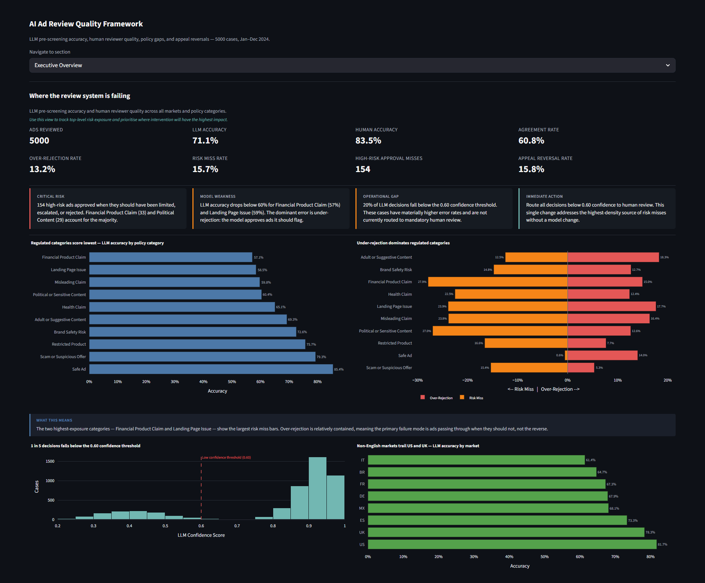
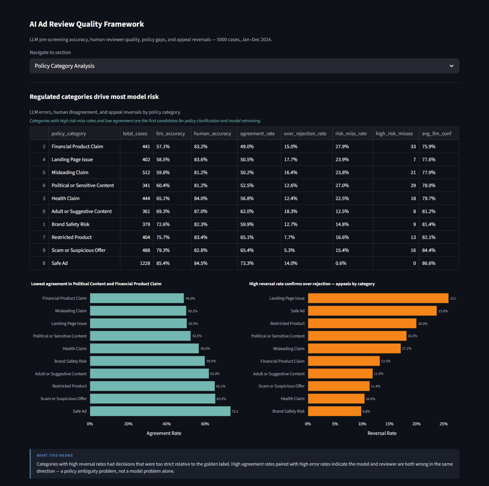
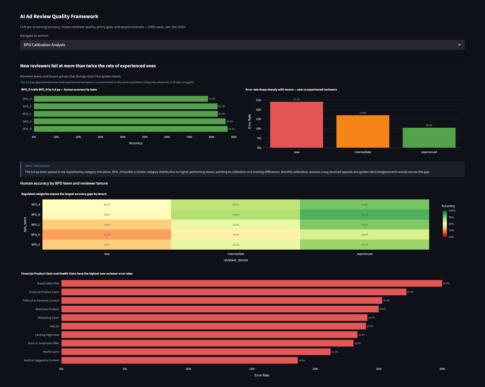
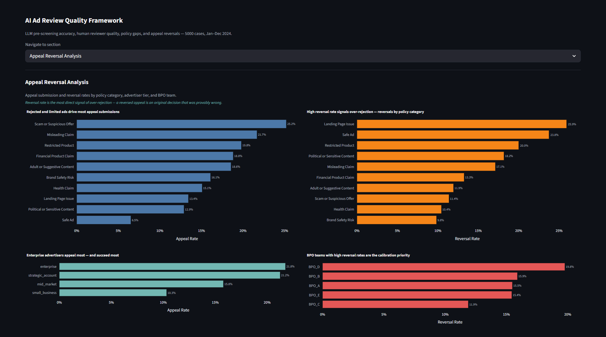

# AI Ad Review Quality Framework

An analytics case study measuring LLM pre-screening accuracy and human reviewer quality in a digital advertising policy workflow.

---

## Context

A digital ad platform runs ads through an LLM before human BPO reviewers make the final policy decision (approve, limit, reject, or escalate). Over 2024, quality data revealed two structural failures: the LLM was approving ads in regulated categories that should have been flagged, and reviewer accuracy varied widely across teams and markets — with no systematic way to feed either signal back to improve the system.

This project builds the measurement framework: a dataset of 5000 synthetic review cases, a Python evaluation pipeline, SQL analysis across each quality dimension, and a Streamlit dashboard to explore results interactively.

---

## Dataset

5000 synthetic ad review cases, January–December 2024.

| Attribute | Details |
|---|---|
| Markets | FR, UK, US, DE, ES, IT, BR, MX |
| Languages | French, English, German, Spanish, Italian, Portuguese |
| Ad formats | Search, Display, Video, Social Feed, Shopping, App Install |
| Policy categories | 10: Safe Ad, Health Claim, Financial Product Claim, Scam, Misleading Claim, and others |
| BPO teams | BPO_A through BPO_E |
| Reviewer tenures | new, intermediate, experienced |

All data is synthetic, generated with a fixed random seed. No real advertiser or review data is included.

---

## Methodology

Each ad carries a golden label — the correct expert decision — used as ground truth. LLM and human decisions are evaluated against it independently.

Errors are directional:

```
approved = 0 | approved_limited = 1 | escalated = 2 | rejected = 3
```

- Over-rejection: LLM severity > golden severity (too strict — generates advertiser friction)
- Risk miss: LLM severity < golden severity (too lenient — policy violations reach inventory)
- High-risk approval miss: risk = high, golden is limited/rejected/escalated, LLM = approved

Full definitions: [docs/methodology.md](docs/methodology.md)

---

## Dashboard Preview

Selected dashboard views from the Streamlit app.

| Executive Overview | Policy Category Analysis |
|---|---|
|  |  |
| BPO Calibration | Model Feedback Examples |
|  |  |

---

## Key Findings

1. **Regulated categories are the weakest link.** LLM accuracy is 85% on Safe Ad and 79% on Scam, but drops to 57% on Financial Product Claim, 59% on Landing Page Issue, and 60% on Misleading Claim. The dominant error in these categories is under-rejection: the model approves or limits ads that should be escalated or rejected.

2. **154 high-risk ads were approved when they should not have been.** Financial Product Claim (33), Political Content (29), and Misleading Claim (21) account for the majority. These are the cases with direct policy exposure consequences.

3. **20% of LLM decisions fall below the 0.60 confidence threshold.** These low-confidence decisions have materially higher error rates. Routing them to mandatory human review is the fastest available lever to reduce risk misses without a model change.

4. **New reviewers make errors at more than twice the rate of experienced reviewers.** Error rate: 24.1% (new) vs. 10.5% (experienced) — a 13.6 pp gap concentrated in Financial Product Claim, Health Claim, and Misleading Claim.

5. **BPO team accuracy spans 8.9 percentage points.** BPO_D (78.4%) trails BPO_B (87.3%). The gap is not explained by policy category mix alone, pointing to calibration and training differences between teams.

6. **15.8% of submitted appeals result in reversal.** Over-rejection stands at 13.2%. Reversals are concentrated in categories where the LLM applied a stricter label than the golden standard — confirming that a meaningful share of rejected or limited ads were incorrect decisions.

7. **Non-English markets show consistently higher disagreement.** BR, IT, DE, and ES diverge from the US/UK baseline across most quality metrics, consistent with local regulatory context not being reflected in current model training or reviewer guidelines.

---

## Recommendations

| Priority | Action | Owner |
|---|---|---|
| High | Route LLM decisions below 0.60 confidence to mandatory human review | Algorithm + Ad Ops |
| High | Weekly review of high-risk approval misses with 3-day remediation SLA | Ad Ops + Quality |
| High | Monthly calibration sessions for Financial Product Claim and Health Claim | BPO Quality |
| High | Extract high-confidence wrong LLM decisions monthly for model retraining | Algorithm |
| Medium | Market-specific policy supplements for BR, IT, DE, ES | Policy (Regional) |
| Medium | Audit over-rejection thresholds in categories with elevated appeal reversals | Policy + Ad Ops |
| Medium | Monthly cross-functional review: BPO calibration data, policy updates, model feedback | Quality Lead |

Full detail: [docs/recommendations.md](docs/recommendations.md)

---

## Project Structure

```
ai-ad-review-quality-framework/
│
├── data/
│   ├── raw/                         # Generated dataset
│   └── processed/                   # Enriched dataset with derived fields
│
├── src/
│   ├── generate_dataset.py          # Generates synthetic_ad_reviews.csv
│   ├── prepare_data.py              # Enriches and validates data
│   ├── evaluate_quality.py          # Calculates and exports all metrics
│   └── utils.py                     # Shared constants and utilities
│
├── sql/
│   ├── 01_create_tables.sql
│   ├── 02_quality_metrics.sql
│   ├── 03_policy_gap_analysis.sql
│   ├── 04_market_language_analysis.sql
│   ├── 05_bpo_calibration_analysis.sql
│   └── 06_model_feedback_examples.sql
│
├── dashboard/
│   ├── streamlit_app.py
│   └── screenshots/
│
├── docs/
│   ├── methodology.md
│   ├── error_taxonomy.md
│   ├── policy_gap_report.md
│   ├── recommendations.md
│   └── data_dictionary.md
│
└── outputs/
    ├── executive_summary.md
    ├── overall_quality_summary.csv
    ├── policy_category_metrics.csv
    ├── market_language_metrics.csv
    ├── bpo_team_metrics.csv
    ├── appeal_reversal_analysis.csv
    └── model_feedback_examples.csv
```

---

## How to Run

```bash
pip install -r requirements.txt
python src/generate_dataset.py
python src/prepare_data.py
python src/evaluate_quality.py
streamlit run dashboard/streamlit_app.py
```

Dashboard opens at `http://localhost:8501`.

SQL analysis runs on DuckDB against the processed CSV:

```python
import duckdb
con = duckdb.connect()
con.execute(open("sql/01_create_tables.sql").read())
result = con.execute(open("sql/02_quality_metrics.sql").read()).fetchdf()
```

---

## Limitations

- All data is synthetic. Real platform metrics will differ.
- The golden label is treated as ground truth. In practice, expert annotators also disagree on borderline cases.
- The LLM is simulated statistically, not via real API calls.
- Landing page content is a single text field. Real evaluation requires URL-level access.
- The dataset is synthetic and designed to simulate realistic ad review patterns. The metrics should be read as controlled scenario outputs, not production benchmarks.

---

## Tech Stack

| Tool | Use |
|---|---|
| Python 3.10+ | Data generation, processing, evaluation |
| pandas | Aggregation and analysis |
| numpy | Reproducible random generation |
| DuckDB | Local SQL queries on CSV files |
| matplotlib | Charts |
| Streamlit | Dashboard |

---

*Portfolio project. All data is synthetic.*
